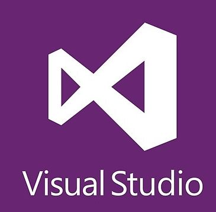

### Hi there 👋 I'm Giuseppe a PhD student at the <a href="https://pni-lab.github.io/">PNI Lab</a>

- 🔭 I’m currently working on Artificial Intelligence for Brain Imaging data
- 🌱 I’m currently learning Machine Learning and Software Development
- 👯 I’m looking to collaborate on Open Science / Open Data
- 📫 How to reach me: <a href="https://twitter.com/g_gallitto">Twitter</a>

 <table>
  <tr>
    <th colspan=4>Most used Languages and Frameworks</th>
  </tr>
  <tr>
    <th></th>
    <th></th>
    <th colspan=2></th>
  </tr>
  <tr>
   <th>Programming Languages</th>
    <td align=center><a href="https://www.python.org/">Python</a></td>
    <td align=center><a href="https://dotnet.microsoft.com/en-us/languages/csharp">C#</a></td>
    <td align=center><a href="https://docs.microsoft.com/en-us/cpp/cpp/?view=msvc-170">C++</a></td>
  </tr>
  <tr>
    <th>Data Processing / Visualization</th>
    <td><a href="https://numpy.org/">Numpy</a>, 
     <a href="https://pandas.pydata.org/">Pandas</a>, 
     <a href="https://matplotlib.org/">Matplotlib</a>, 
     <a href="https://seaborn.pydata.org/">Seaborn</a>
    <td colspan=2 align=center>
custom code, extend python

  </tr>
  <tr>
    <th>Machine Learning</th>
    <td colspan=3><a href="https://scikit-learn.org/stable/index.html">Sci-Kit Learn</a>, 
     <a href="https://pytorch.org/">Pytorch</a>, 
     <a href="https://skorch.readthedocs.io/en/stable/">Skorch</a>
  </tr>
  <tr>
    <th>Big Data</th>
    <td colspan=3><a href="https://dask.org/">Dask</a>, 
     <a href="https://spark.apache.org/docs/latest/api/python/index.html">pySpark</a></td>
  </tr>
</table> 
