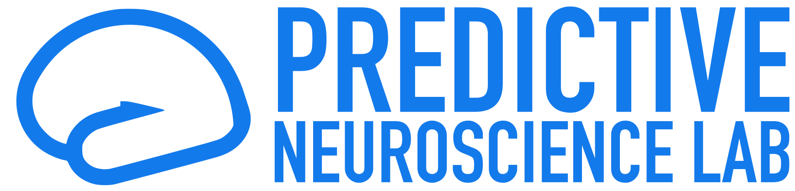

### Hi there 👋 I'm Giuseppe a PhD student @ <a href="https://pni-lab.github.io/">PNI Lab</a>

<table>
 <tr>
    <td colspan=2> 
     - 🔭 I’m currently working on AI-driven Brain Imaging 
     - 🌱 I’m always learning about Machine Learning and Software Development  
     - 👯 I’m looking to collaborate on Open Science / Open Source Software  
     - 📫 How to reach me: see the bio! 
      
    </td>
    <td></td>
 </tr>
</table>
